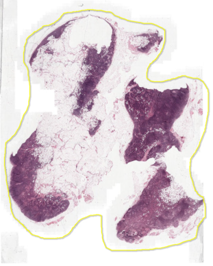
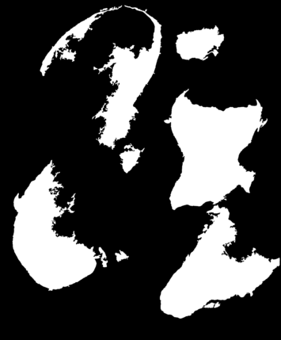

## Preprocessing Tools for Whole Slide Images

This repository contains a set of tools to extract tiles at given magnifications from whole slide images (WSIs).

<br>

### Requirements

__Python-3.7__ , __OpenSlide-Python__ , __Large-Image__, __Spams-2.6.2__

To create the conda environment, do the following:
```
conda create --name test-3.7 --file requirements.txt python=3.7
conda activate test-3.7
pip install large-image[all] --find-links https://girder.github.io/large_image_wheels
```
Install `spams-2.6.1` by downloading the package from [here](http://spams-devel.gforge.inria.fr/downloads.html):
```
cd INRIA-Spams/spams-2.6.1/
python setup.py bdist_wheel
pip install --find-links=dist spams
```
<br>

### Convert XML annotations into masks
To convert Halo XML annotations into masks, use:
```
python from_xml_to_mask.py \
    -input < filepath to CSV containing the WSI filepaths >
    -col-wsi < column name containing the WSI filepaths >
    -col-ann < column name containing the XML filepaths >
    -output < filepath where to save the outputs >
```
This tool creates in the output folder a CSV master index and 2 sub-folders named `annotation_masks/`, 
containing the masks extracted from XML annotations, `label_conversion/`, containing
the JSON to convert the values in the annotation masks into the original string labels. 

 | 

<br>

### Foreground segmentation
To generate binary masks of the WSI foreground, aka the tissue, use:
```
python extract_foreground.py \
    -input < filepath to CSV containing the WSI filepaths >
    -col-wsi < column name containing the WSI filepaths >
    -output < filepath where to save the outputs >
    -mag < target magnification at which to extract the foreground mask >
    -thres-small-obj < threshold for bounding box area under which foreground components are discarded and set to background >
    -pil-enhance < enable PIL color enhancement >
```
This tool creates in the output folder a CSV master index and 3 sub-folders named `wsi_masks/`, containing
the binary masks of the tissue extracted at magnification M, `wsi_thumbs/`, containing
the thumbnails of the original WSIs extracted at magnification M, `wsi_overlays/` containing
the thumbnails overlaid to the tissue masks and that can be used to check the quality of
results at visual inspection. 

 | 

<br>

### Merge annotation and foreground masks
To merge annotation and foreground masks, use:
```
python merge_foreground_and_annotations.py \
    -input-ann < filepath to the CSV  master index containing the annotation masks >
    -input-fg < filepath to the CSV  master index containing the foreground masks >
    -output < filepath where to save the outputs >
```
This tool creates in the output folder a CSV master index and 1 sub-folder named `wsi_merged_foreground_and_annotations/`, 
containing the merged masks. 



<br>

### Rasterize masks
To split the final mask into quasi-fitting boxes, use:
```
python raster_mask.py \
    -input < filepath to the CSV  master index containing the final masks >
    -col-mask < column name containing the mask filepaths >
    -output < filepath where to save the outputs >
```
This tool creates in the output folder a CSV master index and 1 sub-folder named `wsi_overlays/`, 
containing the rasterized masks. 


<br>

### Pseudo-extract tiles
To pseudo-extract tiles from WSIs ("pseudo" because no tile is saved to disk) that can be readily used for deep learning training / inference, use:
```
python pseudo_generate_tiles.py \
    -input < filepath to the CSV master index containing the WSIs and the corresponding final masks > \
    -output < filepath where to the save outputs > \
    -col-wsi < column name containing the WSI filepaths > \
    -mag < magnification(s) at which to extract the tiles > \
    -mag-ref < reference magnification at which to set the grid > \
    -size < size of the tiles to extract > \
    -stride < stride between consecutive tiles to extract > \
    -thres < threshold of foreground percentage that should characterize the tile to be kept > \
    -overlap < percentage of overlap for extraction of tiles > \
    -pil-enhance < enable PIL color enhancement > \
    -n-bad-tiles < select number of tiles allowed to be "bad", i.e. with percentage of foreground below the threshold > \
    -format < specify output format for the WSI-specific tile master indice (either .pkl or .csv) >
```
This tool extracts tiles of a certain size at one or multiple magnifications and creates a master index in the output folder. 

<br>

### Draw thumbnail with tiles for quality control
To draw thumbnails of the original WSIs overlaid with the rectangles of the extracted tiles, use:
```
python draw_thumbnail_tiles.py \
    -input < filepath to CSV master index outputted by the previous step of tile extraction > \
    -output < filepath where to save the outputs > \
    -col-wsi < column name containing the WSI filepaths > \
    -mag-tile < select the magnification of the tiles to draw >
    -mag-draw < select the magnification at which to extract the thumbnail for drawing >
```

 | 

<br>

### Run an end-to-end test
1. Convert the XML annotation file to a mask:
```
python from_xml_to_mask.py -input test_data/master_index.csv -col-wsi filepath_wsi -col-ann filepath_xml -output test_output/from_xml_to_mask/
```
2. Extract tissue foreground from the WSI:
```
python extract_foreground.py -input test_data/master_index.csv -col-wsi filepath_wsi -mag 1.0 -pil-enhance 15 -output test_output/foreground_masks/
```
3. Merge annotation mask with tissue foreground mask:
```
python merge_foreground_and_annotations.py -input-fg test_output/foreground_masks/master_index.csv -input-ann test_output/from_xml_to_mask/master_index_xml_to_mask.csv -output test_output/merge_foreground_and_annotations/
``` 
4. Split merged mask in quasi-fitting rectangular to parallelize the tile extraction afterwards:
```
python raster_mask.py -input test_output/merge_foreground_and_annotations/master_index.csv -col-mask filepath_merged_mask_foreground_and_annotation -output test_output/rasterized_masks/
```
5. Pseudo-extraction of 224x224 tiles at 1.25x,5x,10x,20x using a reference grid at 5x:
```
python pseudo_generate_tiles.py -input test_output/rasterized_masks/master_index.csv -col-wsi filepath_wsi -size 224 -mag 1.25,5,10,20 -mag-ref 5 -output test_output/tile_master_index/ -thres 5
```
6. Draw thumbnail with extracted tiles to check everything is ok:
```
python draw_thumbnail_tiles.py -input test_output/tile_master_index/master_index_tiles_magref5.0.csv -col-wsi filepath_wsi -output test_output/tile_master_index/ -mag-tile 5 -mag-draw 1
```

<br>

### Help
All python scripts handle input arguments through *argparse*. If you want to see the description of the input arguments
and some examples of command line to build type:
```
python <script> -h
```

<br>

### Authors
* **Filippo Arcadu** - December 2020

<br>

### Last Update
29.12.2020
